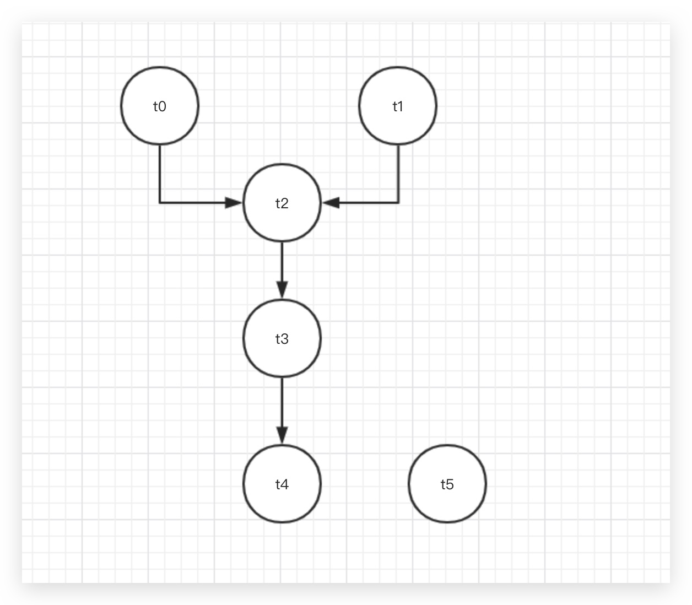

# dag-executor

> 基于多线程 DAG 任务流执行库

## Example

对于如图所示的任务流：



下面是一个单/多线程的 DAG 任务流执行例子：

```java
package tk.fishfish.dagexecutor;

import com.google.common.graph.GraphBuilder;
import com.google.common.graph.MutableGraph;
import org.junit.Test;

/**
 * DAGExecutor测试
 *
 * @author 奔波儿灞
 * @since 1.0
 */
public class DagExecutorTest {

    @Test
    public void singleThread() throws InterruptedException {
        DagExecutor executor = new SingleThreadDagExecutor();
        testExecutor(executor);
    }

    @Test
    public void multiThread() throws InterruptedException {
        // 3. 创建DagExecutor
        DagExecutor executor = new MultiThreadDagExecutor(2, 5);
        testExecutor(executor);
    }


    private void testExecutor(DagExecutor executor) throws InterruptedException {
        // 1. 基于 guava api 构建任务流
        MutableGraph<Runnable> graph = GraphBuilder.directed().build();

        // 任务
        Task t0 = new Task("t0");
        Task t1 = new Task("t1");
        Task t2 = new Task("t2");
        Task t3 = new Task("t3");
        Task t4 = new Task("t4");
        Task t5 = new Task("t5");

        graph.addNode(t0);
        graph.addNode(t1);
        graph.addNode(t2);
        graph.addNode(t3);
        graph.addNode(t4);
        graph.addNode(t5);

        graph.putEdge(t0, t2);
        graph.putEdge(t1, t2);
        graph.putEdge(t2, t3);
        graph.putEdge(t3, t4);

        // 2. 图转换为DAG
        Dag dag = Dag.of(graph);

        System.out.println("hasNextTask: " + dag.hasNextTask());
        System.out.println("hasTasks: " + dag.hasTasks());
        System.out.println("numTasks: " + dag.numTasks());
        System.out.println("getErrors: " + dag.getErrors());
        System.out.println("status: " + dag.status());

        // 4. 提交
        executor.submit(dag);

        Thread.sleep(5 * 1000L);

        System.out.println("hasNextTask: " + dag.hasNextTask());
        System.out.println("hasTasks: " + dag.hasTasks());
        System.out.println("numTasks: " + dag.numTasks());
        System.out.println("getErrors: " + dag.getErrors());
        System.out.println("status: " + dag.status());
    }

}
```

1. 基于 guava 的图api，构建一个 `MutableGraph<Runnable>` 对象
1. 通过 `Dag.of(graph)` 转换成 DAG 对象，如果不是有向无环图则会抛出异常
1. 创建 DagExecutor 实例，这里有单线程、多线程实现
1. 提交 DAG 对象到 executor

## About

平时工作做对任务流框架接触比较多，比如 azkaban、easyschedule 等。他们可以绘制任务流，完成一系列的任务。

因此，这里简单的研究下多线程的 DAG 任务流遍历，没有处理错误重试、通知等。

这里不建议基于此库去二开，毕竟已经有很多优秀的开源产品了。本项目适合学习！！！

## Reference

* [DAGExecutor](https://github.com/idooley/DAGExecutor)
* [dag-flow-platform](https://github.com/a925907195/dag-flow-platform)
